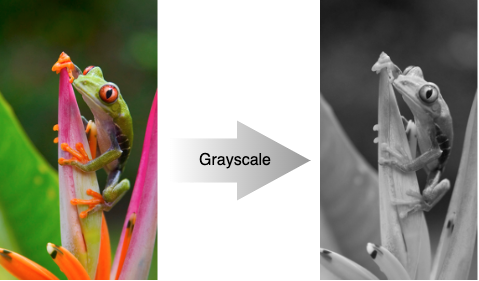

# MTL_ArgSample

This is a sample about the argument manipulation of Metal shader functions.

- Use enum for the index part of [[ buffer(index) ]] and [[ texture(inde) ]].
- Pass data less than 4KB.（ Use setVertexBytes(), setFragmentBytes() ）

